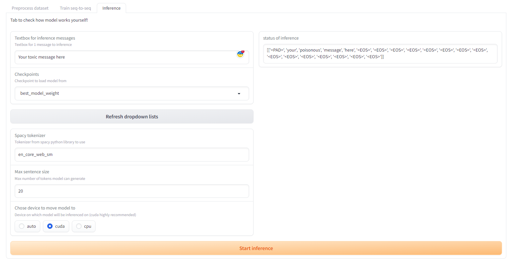

# Text-Detoxification

Local system to train/inference detoxification models with [Gradio](https://pypi.org/project/gradio/) web interface.

| Train example                                  | Inference example |
|------------------------------------------------|-------------------|
|  | |

# How to run
If you are interested to try out this project, all you need to do is to download this
repository and download all required libraries. Make sure to also [download](https://pytorch.org/) `pytroch 2.1.0` (if you do not have it yet) 
from official website (make sure you have `cuda 11.8` enabled).

```shell
pip install -r requirements.txt
python -m spacy download en
python -m spacy download en_core_web_sm
```

After this you are ready to run app from your IDE or console:
```shell
python ui.py
```

P.S. You don't need to train any model yourself in order to check inference tab. This 
repository already have some pretrained model for you to check!

P.P.S. If you are interested in step-by-step tutorial how to use this app, please check
[FinalSolution](https://github.com/cutefluffyfox/text-detoxification/blob/main/reports/FinalSolution.md) markdown file. 

# Repository structure

Repository have pretty simple structure:
* `.data/` - autogenerated folder with all your datasets
  * `.raw/<dataset_name>` - raw dataset files
  * `.intermediate/<dataset_name>` - preprocessed files
* `.checkpoints/` - autogenerated folder with all your checkpoints
  * `<model_type>/<checkpoint_name>` - checkpoints of model
* `.models/` - autogenerated folder with all your models
  * `<model_type>/<model_name>` - folder with all files to run inference with model
* `.notebooks/` - folder with all my research notebooks
* `.reports/` - reports that describe my research workflow
* `.src/` - all code for the visual part of the project

# Credits
Created by Polina Zelenskaya\
Innopolis University DS21-03

Github: github.com/cutefluffyfox\
Email: p.zelenskaya@innopolis.university
