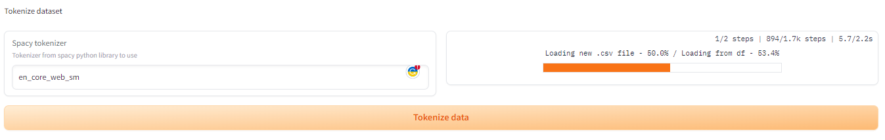

# Final Solution

As final solution I use DL seq-to-seq model trained from scratch. Dataset model is trained
on is [filtered ParaNMT-detox corpus dataset](https://github.com/skoltech-nlp/detox/releases/download/emnlp2021/filtered_paranmt.zip).
However, you can train model on any dataset.This file contain details about each 
step of a solution: data preprocessing, training/validating model and inference.
This report will rely on you using web interface. Please make sure not to skip that step.

### Navigation
* [Setting up environment](#setting-up-environment)
  * [Dataset & Repository](#downloading-dataset-and-repository)
  * [Required libraries](#downloading-required-libraries)
  * [Run web interface](#run-web-interface)
* [Data preprocessing](#data-preprocessing)
  * [Unzip archive](#unzipping-data)
  * [Split by toxicity](#split-dataset-by-toxicity-11-13-hypothesises)
  * [Tokenize data](#tokenize-data)
  * [Create vocab](#create-vocab)
* [Train seq-to-seq model](#training)
  * [seq-to-seq model architecture](#seq-to-seq-architecture)
  * [Train with web ui](#training-with-web-ui)
* [Inference](#inference)
* [Validation](#validation)
* [Credits](#credits)


# Setting up environment

### Downloading dataset and repository
To start speaking about solution is it essential to set up environment. Please
download this repository first and make sure you have `python 3.9+`, `cuda`-friendly
environment and preferably Windows/Ubuntu system (I didn't check whether it works on mac).

Also make sure you downloaded [Para-NMT]((https://github.com/skoltech-nlp/detox/releases/download/emnlp2021/filtered_paranmt.zip)) dataset (or any other where exist columns 
`reference`, `translation`, `similarity`, `lenght_diff`, `ref_tox`, `trn_tox`). Make sure
your dataset is `zip` archive with single `.csv` or `.tsv` file inside. 

When you are done you can continue.

### Downloading required libraries

To start please download all required libraries and spacy tokenizer:
```shell
pip install -r requirements.txt
python -m spacy download en
python -m spacy download en_core_web_sm
```

Then [download](https://pytorch.org/) `pytroch 2.1.0` (if you do not have it yet) from official website.
Make sure to download with `cuda 11.8`.

### Run web interface
Now when you are done, you can run `ui.py` file from your IDE or console and web interface
should pop out in your browser.

```shell
python ui.py
```

| How web interface should look like            |
|-----------------------------------------------|
|  |


# Data Preprocessing

During the next steps, you do not need to change anything in order to reproduce 
the same results as my. Just drag/click buttons and everything should be fine.

### Unzipping data

In order to unzip dataset just drag file to the file attachment window and make sure 
success result will appear on the window in right. If something will went wrong, a pop-up
error/warning will appear.

### Split dataset by toxicity (1.1-1.3 hypothesises)

Please refresh dataset list (it's not dynamic) and chose dataset you want to use. Then
you can define how you would like to clear dataset (by defying `Toxicity difference` 
and `Similarity rate` thresholds). Click button and files `data/intermediate/<dataset>/split`
folder with files `tox.csv` and `non_tox.csv` should appear.


### Tokenize data

I suggest to use spacy tokenizer and current web interface supports only spacy tokenizers. 
However, there is variety in tokenizers so modifying `Spacy tokenizer` field is enough 
to change tokenizer. Worth mentioning that this is a long part that takes ~1 hour total.
You can monitor your progress with progress bar that will appear output window.



### Create vocab

Now you are ready to create a vocab of all words, the only parameter to tune is
`Frequency threshold`. It is used to make model more light and have less trainable parameters.
I used threshold of 40 in order to fit my model in `cuda` memory. I do not recommend such harsh
value, it is recommended to have value near 10 for the best results.


# Training

## seq-to-seq architecture

Before starting training, let's discuss what model architecture we are going to use.
I decided to write my encoder/decoder/attention layers from scratch, so I based my 
solution on [this tutorial](https://github.com/bentrevett/pytorch-seq2seq/blob/master/3%20-%20Neural%20Machine%20Translation%20by%20Jointly%20Learning%20to%20Align%20and%20Translate.ipynb).
Final architecture I went with is:

```
DSkBart(
  (attention): Attention(
    (attn): Linear(in_features=768, out_features=256, bias=True)
    (v): Linear(in_features=256, out_features=1, bias=False)
  )
  (encoder): Encoder(
    (embedding): Embedding(8247, 128)
    (rnn): GRU(128, 256, bidirectional=True)
    (fc): Linear(in_features=512, out_features=256, bias=True)
    (dropout): Dropout(p=0.5, inplace=False)
  )
  (decoder): Decoder(
    (attention): Attention(
      (attn): Linear(in_features=768, out_features=256, bias=True)
      (v): Linear(in_features=256, out_features=1, bias=False)
    )
    (embedding): Embedding(8247, 128)
    (rnn): GRU(640, 256)
    (fc_out): Linear(in_features=896, out_features=8247, bias=True)
    (dropout): Dropout(p=0.5, inplace=False)
  )
)
```

Worth mentioning that `8247` is a vocab size, and it can change depending on your dataset
preprocessing thresholds and dataset itself. For me this vocab size resulted to be ideal
as it provided reasonable amount of training parameters and model size to be trainable within
the day (I spend 11 hours total training) and light enough to fit into my GPU memory (NVIDIA 2080 Super mobile).

In this architecture I use bidirectional GRU layers with embedding dimension of 128 (same memory problem)
and high dropout rate (not 0.1 defined in data exploration). This is due to recommendations from 
bentrevett's tutorial.

Model initialized from `mean=0` and `std=0.01` to make simplified version of model. 
Total number of trainable parameters is `11,119,799`.

In addition, I used `Adam` optimizer and `CrossEntropyLoss` as loss function (our 
training process is for encoder-decoder to reproduce output word-to-word, so it's a 
good simple choice).

### Training with web-ui

First of all please select dataset to use (make sure you preprocessed and tokenize dataset
before) and chose vocab to base your model on. You can also choose checkpoint to 
continue training from, however you can set value to `random` in order to randomly 
initialize model from normal distribution with `mean=0` and `std=0.01`.

Define `train_size`, `Dataset split`, `Max sentence size`, `Batch size` and `Number of epochs`
parameters. If you are training from checkpoint, make sure to set `max_sentence_size` and `vocab`
the same as in original training.

Then select device to train your model on (it's highly recommended to use cuda, because
even on it is could take hours per epoch).

P.S. On my GPU 1 minute of epoch is approximately `16000` iterations. So to make training reasonable
I set Dataset split value to `384000` (approximately 24 minutes).


# Inference

And final step to test model is to make inference page. Define dataset, vocab, checkpoint,
tokenizer and max sentence size the same as in training/preprocessing steps. Chose any device
(as inference is only for 1 sentence, it doesn't really matter in terms of speed). 

Everything that really matters is to write any message in 'Textbox for inference messages' and 
click 'Start inference' button


# Validation

Validation of model is not present in web interface, however you can check [ModelExploration](https://github.com/cutefluffyfox/text-detoxification/blob/main/notebooks/ModelExploration.ipynb)
if you are interested in code. But I can show the results on random subset of `384` sentences:

| Predicted/Expected scores                           |
|-----------------------------------------------------|
|  |

Mean/Std statistics for each step:

| Type     | mean   | std    |
|----------|--------|--------|
| Initial  | 0.9668 | 0.0484 |
| Resulted | 0.0341 | 0.138  |
| Expected | 0.0204 | 0.0391 |


We can see that our seq-to-seq model removed most toxicity from sentences. Meaning
our DL approach can provide better results in general. The main downside is the speed of
such solution, as I was only able to get 300 samples in a reasonable amount of time, when
compared to Baseline whole 30000 samples. 

Also, we just reduce toxicity score, when in practice we also need to check meaning similarity
as it was defined in the raw dataset. Still, we can see that DL solution tends to be superior
to baseline one, resulting in significant improvement from 50% success to 90%+ one.


# Credits
Created by Polina Zelenskaya\
Innopolis University DS21-03

Github: github.com/cutefluffyfox\
Email: p.zelenskaya@innopolis.university

