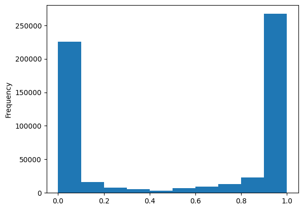
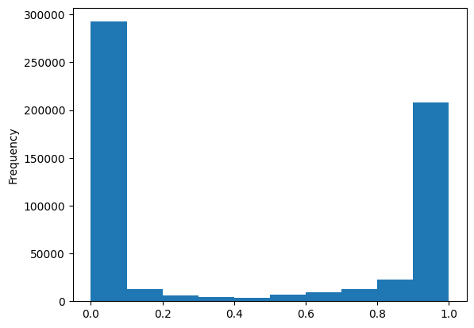
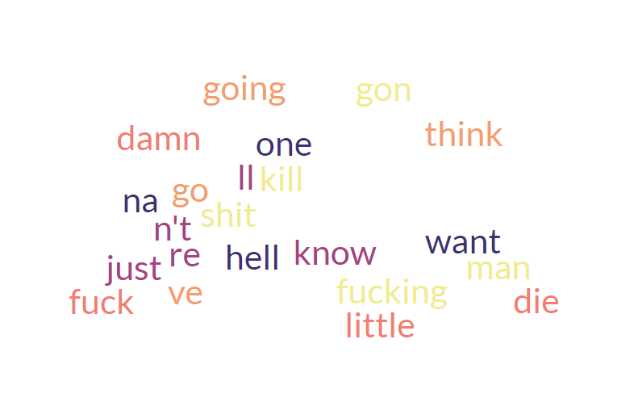
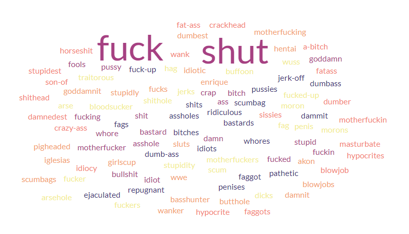
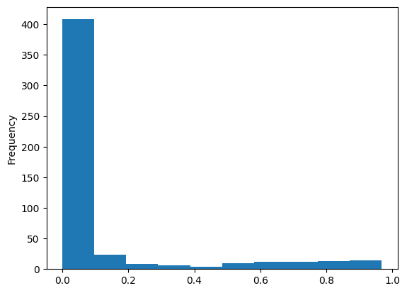
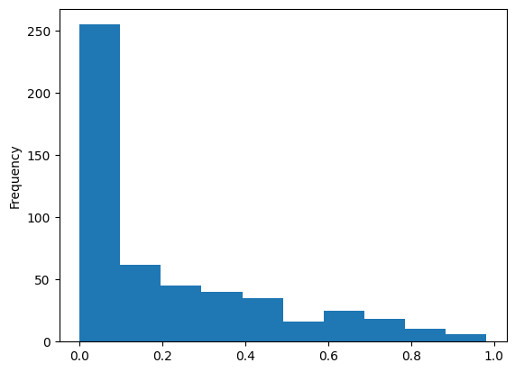
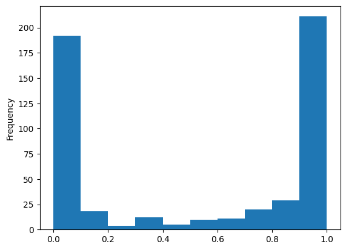
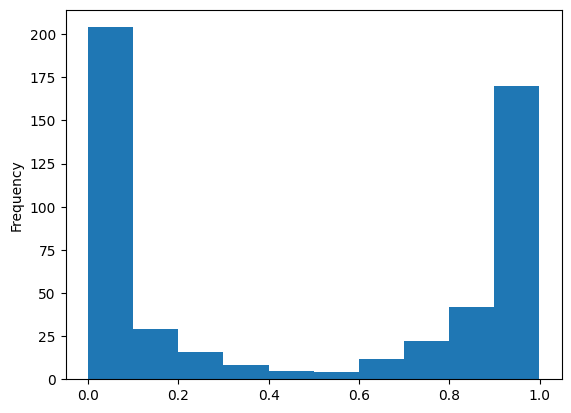
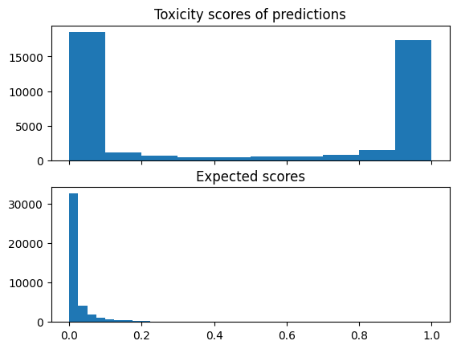

# Hypothesis formulation & Data Analysis

### Navigation
* [About](#about-this-report)
* [Data exploration](#data-exploration)
  * [Basic dataset info](#what-is-filteredparanmt-dataset)
  * [Numeric features](#numeric-features)
  * [Text features](#text-features)
  * [Hypothesis about data](#data-hypothesis)
* [Toxicity measuring](#how-to-measure-toxicity)
  * [Model from dataset](#model-from-the-dataset)
  * [Detoxify](#detoxify-solution)
  * [Hugging face default](#huggingface---toxicity-default)
  * [Hugging face daNLP](#huggingface---danlp)
  * [Model comparison analysis](#model-comparison-analysis)
* [Existing detoxifiers](#existing-solutions)
  * [How DL-detoxification works](#how-dl-detoxification-pipeline-looks-like)
  * [How dataset model designed](#how-initial-model-from-the-dataset-designed)
  * [Other detoxification architectures](#other-detoxification-architectures)
  * [Architecture for other seq-to-seq tasks](#architectures-for-other-seq-to-seq-tasks)
  * [Model comparison analysis](#model-comparison-analysis)
* [Baseline solution](#baseline-solution)
  * [Preprocessing](#preprocessing)
  * [Solution](#solution)
  * [Validation](#validation)
  * [Final comments](#final-comments)
* [Credits](#credits)


### About this report
This is 1st report on detoxification task. This report contains information about 
notebooks folder, to be more precise about 
[data analysis¹](https://github.com/cutefluffyfox/text-detoxification/blob/main/notebooks/LearningDataset.ipynb),
[toxicity measuring²](https://github.com/cutefluffyfox/text-detoxification/blob/main/notebooks/ToxicityMeasuring.ipynb),
[architecture analysis of DL models³](https://github.com/cutefluffyfox/text-detoxification/blob/main/notebooks/ModelExploration.ipynb),
[baseline solution⁴](https://github.com/cutefluffyfox/text-detoxification/blob/main/notebooks/BaselineSolution.ipynb) and
[DL-based solution⁵](https://github.com/cutefluffyfox/text-detoxification/blob/main/notebooks/ModelExploration.ipynb).

This report will also contain information about final solution, however for more details please
refer to `FinalSolution.md` file in the same directory. There you can find a step-by-step
tutorial how to reproduce our results and how to train detoxification model for any dataset (with nice web interface!).

# Data exploration

### What is filtered_paranmt dataset

To analyze something in the data, we first need to get known with the dataset itself.
The dataset we are using is [filtered ParaNMT-detox corpus dataset](https://github.com/skoltech-nlp/detox/releases/download/emnlp2021/filtered_paranmt.zip).

Let's start with something simple, by looking at columns and what information they store:
* `reference [str]` - First item from the pair
* `ref_tox [float]` - toxicity level of reference text
* `translation [str]` - second item from the pair - paraphrased version of the reference
* `trn_tox [float]` - toxicity level of translation text
* `similarity [float]` - cosine similarity of the texts
* `lenght_diff [float]` - relative length difference between texts

Sometimes it is important to know into how dataset was created, so lets deep into it. 
The first version of the dataset was initially [published](https://aclanthology.org/P18-1042.pdf) by John Wieting and Kevin Gimpel. 
The dataset contained generated pairs of text. This [initial datase](https://drive.google.com/file/d/19NQ87gEFYu3zOIp_VNYQZgmnwRuSIyJd/view) as well as processed 
version did not contain information about toxicity rate and similarity.So let's move on.

Next 'layer' is [s-nlp/detox](https://github.com/s-nlp/detox) modification. They made their own version of the dataset based on 
original [ParaNMT-50m](https://drive.google.com/u/0/uc?id=1rbF3daJjCsa1-fu2GANeJd2FBXos1ugD&export=download) made especially for detoxification. In this modification they added `tox_score` 
for `reference` and `tranlation` columns, as well as `simmilarity` column that corresponds how similar texts are.
And finally `length_diff` that corresponds to relative length difference between original/translated messages.

For now, we will not dig further to say how exactly `s-nlp` did it, because we will consider it in details further.

So, now when we have idea where dataset originates from and what it contains, let's look at data distibutions 
in the dataset.

### Numeric features

In dataset, we have 4 numeric columns: `tox_scores` (for translated/referred messages), `simmilarity` and `length_diff`.
All of these features have no `null` values, so dataset is complete. We can start analysing features by looking
at some basic statistics in the data (`df.column.describe()`):

|      | length_diff | similarity | ref_tox  | trn_tox  |
|------|-------------|------------|----------|----------|
| mean | 0.157652    | 0.758469   | 0.541372 | 0.434490 |
| std  | 0.108057    | 0.092695   | 0.457571 | 0.458904 |
| min  | 0.000000    | 0.600001   | 0.000033 | 0.000033 |
| 25%  | 0.066667    | 0.681105   | 0.012171 | 0.000707 |
| 50%  | 0.141791    | 0.754439   | 0.806795 | 0.085133 |
| 75%  | 0.238095    | 0.831244   | 0.990469 | 0.973739 |
| max  | 0.400000    | 0.950000   | 0.999724 | 0.999730 |

From such simple table we can already derive some conclusions and formulate some ideas.

First is that reference and translation texts on average provide 75% similarity (with 9% std), 
which is pretty good for paraphrasing dataset. Also, percentile statistics showed that there are no 
'radical' outliers in text differences (as lowest score is 0.6 with mean=0.75 and std=0.09).

We can also see that toxic and non-toxic texts differs in length, however I failed to understand how 
score is calculated (I looked at `#of_words` and `len(sentence)` correlation with `length_diff` column, and
none of them provided 1-1 correlation). So for this reason and a reason that this column have metrix purpose 
(not feature for detoxification) I will ignore `length_diff` feature further.

Data seems to have little-to-no outliers based on statistics seen above. Nevertheless, some 
edge-cases should be considered/filtered (such as 0.5 toxicity rated) in preprocessing step to clean data.

Worth mentioning is that ref_tox and trn_tox values seems to be mixed. From initial understanding of the 
dataset, you may get an impression that translation messages are meant to be the non-toxic one, when 
references otherwise. However, this idea seems to be false as we can see that both columns have high amount of
toxic and non-toxic sentences. Let's take a closer look by drawing histograms:


|               ref_tox column histogram                |          trn_tox column histogram           |
|:-----------------------------------------------------:|:-------------------------------------------:|
|  |  |


From histograms, we can clearly see that values tend to 0 or to 1. Also `ref_tox` 
have more toxic values, when `trn_tox` otherwise. Still, both of them have most of the values
in <0.1 and >0.9 range. However, these middle values may still need to be considered and maybe 
even removed in order to make dataset cleaner.


### Text features

In dataset, we have 2 text columns: `ref` and `trn`. In order to analyze them 
I will try to find some patterns in single-words usages (not bigrams or other more
complex combinations).

First it's always recommended to tokenize data, so by applying `nltk.tokenize.word_tokenize`
function and calculating `nltk.probability.FreqDist` for the whole dataset we can get top 100
most common words in the whole dataset:

<details>
<summary>Click here to see the results (!CW: curse words!)</summary>



Or raw list of tokens (from most frequent -> to less frequent one)
> Out[9]: ". , you the i a to and of 's ? it n't he in that ! do your ... me is my with 're was we have for this be on if what `` like him they but 'm his out are up her '' not 'll get all so she just know as who one want or will did at about hell would when them can there na here no shit fucking an gon kill had from man now were got think go going then off how could 've damn 'd because us little fuck why ' die"
</details>


We can see that frequency statistics is not that useful. It is true that some toxic words
appeared in most common, however also neutral words such as "i", "have", "would" e.t.c. also
present there. 

In order to try to highlight some toxic words, we can look at pairs of words and tox scores
where they appear. Then we can calculate some basic statistics (mean, std) and try to determine
toxic words (words with high mean toxicity value).

By applying such technique and setting thresholds for words with high 
toxicity level (>0.6) and low std (<0.2) for common words (>50 occurrences) we get next list of words:

<details>
<summary>Click here to see the results (!CW: curse words!)</summary>



Or raw table of tokens:

| token          | mean  | std   |
|----------------|-------|-------|
| ass            | 0.987 | 0.071 |
| crap           | 0.952 | 0.163 |
| shit           | 0.988 | 0.065 |
| bitch          | 0.992 | 0.061 |
| fuck           | 0.991 | 0.067 |
| fucking        | 0.973 | 0.106 |
| bastard        | 0.970 | 0.137 |
| fools          | 0.949 | 0.177 |
| 'shut          | 0.973 | 0.131 |
| damn           | 0.936 | 0.194 |
| stupid         | 0.968 | 0.145 |
| whore          | 0.961 | 0.155 |
| motherfucker   | 0.999 | 0.002 |
| pussy          | 0.992 | 0.065 |
| fucked         | 0.989 | 0.064 |
| bullshit       | 0.990 | 0.052 |
| goddamn        | 0.985 | 0.053 |
| fuckin         | 0.952 | 0.131 |
| asshole        | 0.988 | 0.074 |
| idiot          | 0.971 | 0.136 |
| dumbass        | 0.990 | 0.071 |
| ridiculous     | 0.922 | 0.182 |
| shits          | 0.933 | 0.196 |
| ejaculated     | 0.894 | 0.193 |
| idiots         | 0.996 | 0.047 |
| bitches        | 0.981 | 0.111 |
| pathetic       | 0.977 | 0.085 |
| penises        | 0.954 | 0.156 |
| faggot         | 0.995 | 0.010 |
| dammit         | 0.993 | 0.056 |
| pussies        | 0.989 | 0.060 |
| dumb-ass       | 0.998 | 0.008 |
| bastards       | 0.986 | 0.093 |
| jerk-off       | 0.954 | 0.160 |
| whores         | 0.962 | 0.145 |
| scumbag        | 0.998 | 0.006 |
| fuck-up        | 0.956 | 0.146 |
| assholes       | 0.989 | 0.071 |
| repugnant      | 0.919 | 0.142 |
| fags           | 0.988 | 0.066 |
| traitorous     | 0.905 | 0.178 |
| penis          | 0.944 | 0.192 |
| motherfuckers  | 0.998 | 0.013 |
| fag            | 0.973 | 0.120 |
| fucked-up      | 0.988 | 0.058 |
| buffoon        | 0.953 | 0.155 |
| hag            | 0.932 | 0.180 |
| jerks          | 0.965 | 0.148 |
| moron          | 0.978 | 0.114 |
| -shut          | 0.982 | 0.126 |
| dicks          | 0.994 | 0.013 |
| bloodsucker    | 0.927 | 0.156 |
| stupidity      | 0.985 | 0.094 |
| fucker         | 0.996 | 0.042 |
| fuckers        | 0.998 | 0.005 |
| shithole       | 0.978 | 0.063 |
| scum           | 0.988 | 0.053 |
| arsehole       | 0.982 | 0.038 |
| 'fuck          | 0.999 | 0.001 |
| wuss           | 0.953 | 0.143 |
| morons         | 0.992 | 0.066 |
| arse           | 0.946 | 0.188 |
| damnit         | 0.988 | 0.021 |
| sluts          | 0.967 | 0.121 |
| stupidly       | 0.937 | 0.166 |
| idiotic        | 0.978 | 0.106 |
| 2girls1cup     | 0.967 | 0.078 |
| wwe            | 0.967 | 0.078 |
| hentai         | 0.967 | 0.078 |
| enrique        | 0.924 | 0.200 |
| iglesias       | 0.927 | 0.198 |
| basshunter     | 0.962 | 0.103 |
| akon           | 0.958 | 0.118 |
| butthole       | 0.941 | 0.188 |
| motherfucking  | 0.991 | 0.016 |
| fucks          | 0.964 | 0.149 |
| dumbest        | 0.957 | 0.175 |
| wanker         | 0.951 | 0.175 |
| scumbags       | 0.989 | 0.076 |
| blowjobs       | 0.971 | 0.125 |
| pigheaded      | 0.963 | 0.057 |
| goddamnit      | 0.932 | 0.122 |
| blowjob        | 0.970 | 0.139 |
| idiocy         | 0.976 | 0.125 |
| dumber         | 0.947 | 0.170 |
| crackhead      | 0.920 | 0.182 |
| fatass         | 0.936 | 0.177 |
| wank           | 0.928 | 0.183 |
| son-of-a-bitch | 0.997 | 0.005 |
| hypocrite      | 0.935 | 0.189 |
| stupidest      | 0.996 | 0.017 |
| faggots        | 0.980 | 0.058 |
| motherfuckin   | 0.982 | 0.019 |
| fat-ass        | 0.986 | 0.028 |
| crazy-ass      | 0.948 | 0.125 |
| damnedest      | 0.946 | 0.077 |
| masturbate     | 0.959 | 0.174 |
| sissies        | 0.988 | 0.012 |
| hypocrites     | 0.930 | 0.181 |
| shithead       | 0.972 | 0.142 |
| horseshit      | 0.949 | 0.150 |
| dipshit        | 0.960 | 0.159 |
| wankers        | 0.978 | 0.047 |

</details>

It's fair to say that more toxic words appeared 'classified-as-toxic' sentences than
in just frequency analysis.

Most of them selected words resulted to be a curse words. This seems expected as 
we selected words with high mean toxicity-value (>0.9) and low standard deviation (<0.2).
Even with loose parameters this shows strong correlation between such words and 
toxic value.

Context-dependent words such as 'kill' didn't result in a high-mean-low-std (HMLS) 
list, which shows that single-word analysis is not enough to remove toxicity from 
the given queries. Bigrams and more advanced techniques should be used to analyse 
and preprocess dataset better. However, I will not cover them now.

Also, we can see that dataset is biased towards some topics: 
WWE (wrestling company) and Enrique (I can guess a celebrity) resulted in a 
list of HMLS-words, which ideally should not happen. So such things should be 
considered during evaluation step.

### Data hypothesis

1.1 During data preprocessing introduce new features `toxic` and `non-toxic` based on `ref_tox` and `trn_tox` scores.\
1.2 Introduce `toxisity_difference` threashold duting preprocessing.\
1.3 Tune which `simmilarity` value to consider in order to save sense of the sentences.\
1.4 Some of the curse words tend to results in higher toxicity rate, so emphasizing and removing such words may increase model performance.\
1.5 Further analysis of bigrams and other more complex word combinations should be considered in order to find more patterns in data.\
1.6 Baseline solution may be a dict of all high-mean-low-std words that should be replaced to synonyms or just removed


# How to measure toxicity

In this section we will explore ways to measure toxicity score,
how it was done in the original notebook and what other techniques exist.

### model from the dataset
We already know that `s-nlp/detox` added such scores to the dataset, so let's dive deeper.

From their [GitHub repository](https://github.com/s-nlp/detox) we can clearly see 
that metric they use is based on `SkolkovoInstitute/roberta_toxicity_classifier` 
and simmilarity rate is `wieting_similarity` (Where `roberta_toxicity_classifier` is 
fine-tuned [roberta-large](https://arxiv.org/abs/1907.11692) trained on [jigsaw's datasets](https://www.kaggle.com/c/jigsaw-unintended-bias-in-toxicity-classification)).

Knowing all that, we can run these model ourselves and compare it predictions to
target toxicity scores. 

| `SkolkovoInstitute/roberta_toxicity_classifier` (absolute difference with prediction and target) |
|------------------------------------------------------------------------------------------------|
|                                               |

From the graph we can see that our predictions seems to correlate with real labels, 
however from random samples size 512 (classifier takes too long to run on the whole dataset) 
not even 400 have error less than 0.1, which is conserving. We can say that this 
classifier seems good enough for a task to analyze overall model performance. 
In addition, we can clean dataset by ignoring some samples where values between 
actual labels and predicted differs a lot by considering that data may be 
mislabeled. This could also have a potential to make dataset cleaner.

### Detoxify solution

[Detoxify](A python library for detecting toxic comments. Toxic Comment Classification with Pytorch Lightning and Transformers.) is a python library for detecting toxic comments. As a base it uses a Pytorch
Lightning and Transformers models. It is popular choice for its simplicity and accuracy.

| Detoxify (absolute difference with prediction and target) |
|-----------------------------------------------------------|
|                   |


### HuggingFace - toxicity default

Another popular choice is toxicity classifier that Hugging face suggests as default -
`facebook/roberta-hate-speech-dynabench-r4-target` model trained on [Learning from the worst](https://arxiv.org/abs/2012.15761) dataset

| `facebook/roberta-hate-speech-dynabench-r4-target` (absolute difference with prediction and target)  |
|------------------------------------------------------------------------------------------------------|
|                                                    |


# HuggingFace - DaNLP
Another popular solution from HuggingFace. Danish ELECTRA for hate speech (offensive language) detection trained on Danish Ælæctra dataset

| `DaNLP/da-electra-hatespeech-detection` (absolute difference with prediction and target) |
|------------------------------------------------------------------------------------------|
|                                                     |


### Model comparison analysis

As we can see by histograms, it's pretty easy to day that `SkolkovoInstitute/roberta_toxicity_classifier` is 
superior to others. However, worth mentioning that `Detoxify` performed pretty 
good compared to HuggingFace models and showed pretty strong correlation between 
its predictions and unseen labels.

Both `roberta-hate-speech-dynabench-r4-target` and `da-electra-hatespeech-detection` 
showed uncertainty about the labels, with facebook's model disagreeing with most 
of the labels. For this reason using these models seems not so helpful as metric.


# Existing solutions

### How DL-detoxification pipeline looks like

We can formulate detoxification task as text-to-text translation, or to be more precise 
sequence-to-sequence (because languages is a sequences of words/text). And now it is 
pretty easy to understand that we are working with translation task. One of the 
most popular architecture for seq-to-seq tasks is transformers.

Transformers is a subclass of neural network which solves a problem of Sequence 
Transduction (machine translation). Transformers are gaining popularity as they 
solve variety of tasks related to sequences (such as text/speech related problems). 
Such neural network models are based on idea of memory: recurrent layers, memory 
cells. It is also a common thing to see some kind of importance and attention to 
highlight key parts model should be focused on.

Knowing all that we can start looking at existing solutions and try to understand 
how and why they work.

### How initial model from the dataset designed

As we already know, scores in this dataset was generated by `SkolkovoInstitute/roberta_toxicity_classifier`, 
however authors of such model also made a detoxification model, so let's look 
into architecture that original authors proposed - `SkolkovoInstitute/bart-base-detox`

```text
BartForConditionalGeneration(
  (model): BartModel(
    (shared): Embedding(50266, 768, padding_idx=1)
    (encoder): BartEncoder(
      (embed_tokens): Embedding(50266, 768, padding_idx=1)
      (embed_positions): BartLearnedPositionalEmbedding(1026, 768)
      (layers): ModuleList(
        (0-5): 6 x BartEncoderLayer(
          (self_attn): BartAttention(
            (k_proj): Linear(in_features=768, out_features=768, bias=True)
            (v_proj): Linear(in_features=768, out_features=768, bias=True)
            (q_proj): Linear(in_features=768, out_features=768, bias=True)
            (out_proj): Linear(in_features=768, out_features=768, bias=True)
          )
          (self_attn_layer_norm): LayerNorm((768,), eps=1e-05, elementwise_affine=True)
          (activation_fn): GELUActivation()
          (fc1): Linear(in_features=768, out_features=3072, bias=True)
          (fc2): Linear(in_features=3072, out_features=768, bias=True)
          (final_layer_norm): LayerNorm((768,), eps=1e-05, elementwise_affine=True)
        )
      )
      (layernorm_embedding): LayerNorm((768,), eps=1e-05, elementwise_affine=True)
    )
    (decoder): BartDecoder(
      (embed_tokens): Embedding(50266, 768, padding_idx=1)
      (embed_positions): BartLearnedPositionalEmbedding(1026, 768)
      (layers): ModuleList(
        (0-5): 6 x BartDecoderLayer(
          (self_attn): BartAttention(
            (k_proj): Linear(in_features=768, out_features=768, bias=True)
            (v_proj): Linear(in_features=768, out_features=768, bias=True)
            (q_proj): Linear(in_features=768, out_features=768, bias=True)
            (out_proj): Linear(in_features=768, out_features=768, bias=True)
          )
          (activation_fn): GELUActivation()
          (self_attn_layer_norm): LayerNorm((768,), eps=1e-05, elementwise_affine=True)
          (encoder_attn): BartAttention(
            (k_proj): Linear(in_features=768, out_features=768, bias=True)
            (v_proj): Linear(in_features=768, out_features=768, bias=True)
            (q_proj): Linear(in_features=768, out_features=768, bias=True)
            (out_proj): Linear(in_features=768, out_features=768, bias=True)
          )
          (encoder_attn_layer_norm): LayerNorm((768,), eps=1e-05, elementwise_affine=True)
          (fc1): Linear(in_features=768, out_features=3072, bias=True)
          (fc2): Linear(in_features=3072, out_features=768, bias=True)
          (final_layer_norm): LayerNorm((768,), eps=1e-05, elementwise_affine=True)
        )
      )
      (layernorm_embedding): LayerNorm((768,), eps=1e-05, elementwise_affine=True)
    )
  )
  (lm_head): Linear(in_features=768, out_features=50266, bias=False)
)

```

### Other detoxification architectures

Let's look what other architectures exists. One of the most popular choices is 
t5 model. Let's compare it with proposed one.

```text
T5ForConditionalGeneration(
  (shared): Embedding(32128, 768)
  (encoder): T5Stack(
    (embed_tokens): Embedding(32128, 768)
    (block): ModuleList(
      (0): T5Block(
        (layer): ModuleList(
          (0): T5LayerSelfAttention(
            (SelfAttention): T5Attention(
              (q): Linear(in_features=768, out_features=768, bias=False)
              (k): Linear(in_features=768, out_features=768, bias=False)
              (v): Linear(in_features=768, out_features=768, bias=False)
              (o): Linear(in_features=768, out_features=768, bias=False)
              (relative_attention_bias): Embedding(32, 12)
            )
            (layer_norm): T5LayerNorm()
            (dropout): Dropout(p=0.1, inplace=False)
          )
          (1): T5LayerFF(
            (DenseReluDense): T5DenseActDense(
              (wi): Linear(in_features=768, out_features=3072, bias=False)
              (wo): Linear(in_features=3072, out_features=768, bias=False)
              (dropout): Dropout(p=0.1, inplace=False)
              (act): ReLU()
            )
            (layer_norm): T5LayerNorm()
            (dropout): Dropout(p=0.1, inplace=False)
          )
        )
      )
      (1-11): 11 x T5Block(
        (layer): ModuleList(
          (0): T5LayerSelfAttention(
            (SelfAttention): T5Attention(
              (q): Linear(in_features=768, out_features=768, bias=False)
              (k): Linear(in_features=768, out_features=768, bias=False)
              (v): Linear(in_features=768, out_features=768, bias=False)
              (o): Linear(in_features=768, out_features=768, bias=False)
            )
            (layer_norm): T5LayerNorm()
            (dropout): Dropout(p=0.1, inplace=False)
          )
          (1): T5LayerFF(
            (DenseReluDense): T5DenseActDense(
              (wi): Linear(in_features=768, out_features=3072, bias=False)
              (wo): Linear(in_features=3072, out_features=768, bias=False)
              (dropout): Dropout(p=0.1, inplace=False)
              (act): ReLU()
            )
            (layer_norm): T5LayerNorm()
            (dropout): Dropout(p=0.1, inplace=False)
          )
        )
      )
    )
    (final_layer_norm): T5LayerNorm()
    (dropout): Dropout(p=0.1, inplace=False)
  )
  (decoder): T5Stack(
    (embed_tokens): Embedding(32128, 768)
    (block): ModuleList(
      (0): T5Block(
        (layer): ModuleList(
          (0): T5LayerSelfAttention(
            (SelfAttention): T5Attention(
              (q): Linear(in_features=768, out_features=768, bias=False)
              (k): Linear(in_features=768, out_features=768, bias=False)
              (v): Linear(in_features=768, out_features=768, bias=False)
              (o): Linear(in_features=768, out_features=768, bias=False)
              (relative_attention_bias): Embedding(32, 12)
            )
            (layer_norm): T5LayerNorm()
            (dropout): Dropout(p=0.1, inplace=False)
          )
          (1): T5LayerCrossAttention(
            (EncDecAttention): T5Attention(
              (q): Linear(in_features=768, out_features=768, bias=False)
              (k): Linear(in_features=768, out_features=768, bias=False)
              (v): Linear(in_features=768, out_features=768, bias=False)
              (o): Linear(in_features=768, out_features=768, bias=False)
            )
            (layer_norm): T5LayerNorm()
            (dropout): Dropout(p=0.1, inplace=False)
          )
          (2): T5LayerFF(
            (DenseReluDense): T5DenseActDense(
              (wi): Linear(in_features=768, out_features=3072, bias=False)
              (wo): Linear(in_features=3072, out_features=768, bias=False)
              (dropout): Dropout(p=0.1, inplace=False)
              (act): ReLU()
            )
            (layer_norm): T5LayerNorm()
            (dropout): Dropout(p=0.1, inplace=False)
          )
        )
      )
      (1-11): 11 x T5Block(
        (layer): ModuleList(
          (0): T5LayerSelfAttention(
            (SelfAttention): T5Attention(
              (q): Linear(in_features=768, out_features=768, bias=False)
              (k): Linear(in_features=768, out_features=768, bias=False)
              (v): Linear(in_features=768, out_features=768, bias=False)
              (o): Linear(in_features=768, out_features=768, bias=False)
            )
            (layer_norm): T5LayerNorm()
            (dropout): Dropout(p=0.1, inplace=False)
          )
          (1): T5LayerCrossAttention(
            (EncDecAttention): T5Attention(
              (q): Linear(in_features=768, out_features=768, bias=False)
              (k): Linear(in_features=768, out_features=768, bias=False)
              (v): Linear(in_features=768, out_features=768, bias=False)
              (o): Linear(in_features=768, out_features=768, bias=False)
            )
            (layer_norm): T5LayerNorm()
            (dropout): Dropout(p=0.1, inplace=False)
          )
          (2): T5LayerFF(
            (DenseReluDense): T5DenseActDense(
              (wi): Linear(in_features=768, out_features=3072, bias=False)
              (wo): Linear(in_features=3072, out_features=768, bias=False)
              (dropout): Dropout(p=0.1, inplace=False)
              (act): ReLU()
            )
            (layer_norm): T5LayerNorm()
            (dropout): Dropout(p=0.1, inplace=False)
          )
        )
      )
    )
    (final_layer_norm): T5LayerNorm()
    (dropout): Dropout(p=0.1, inplace=False)
  )
  (lm_head): Linear(in_features=768, out_features=32128, bias=False)
)
```

### Architectures for other seq-to-seq tasks
And for curiosity it would be interesting to check how architecture differs with 
models for other tasks. For example whether there is difference with language 
model architectures. Let's use `bert-base-uncased` as an example.

```text
BertForMaskedLM(
  (bert): BertModel(
    (embeddings): BertEmbeddings(
      (word_embeddings): Embedding(30522, 768, padding_idx=0)
      (position_embeddings): Embedding(512, 768)
      (token_type_embeddings): Embedding(2, 768)
      (LayerNorm): LayerNorm((768,), eps=1e-12, elementwise_affine=True)
      (dropout): Dropout(p=0.1, inplace=False)
    )
    (encoder): BertEncoder(
      (layer): ModuleList(
        (0-11): 12 x BertLayer(
          (attention): BertAttention(
            (self): BertSelfAttention(
              (query): Linear(in_features=768, out_features=768, bias=True)
              (key): Linear(in_features=768, out_features=768, bias=True)
              (value): Linear(in_features=768, out_features=768, bias=True)
              (dropout): Dropout(p=0.1, inplace=False)
            )
            (output): BertSelfOutput(
              (dense): Linear(in_features=768, out_features=768, bias=True)
              (LayerNorm): LayerNorm((768,), eps=1e-12, elementwise_affine=True)
              (dropout): Dropout(p=0.1, inplace=False)
            )
          )
          (intermediate): BertIntermediate(
            (dense): Linear(in_features=768, out_features=3072, bias=True)
            (intermediate_act_fn): GELUActivation()
          )
          (output): BertOutput(
            (dense): Linear(in_features=3072, out_features=768, bias=True)
            (LayerNorm): LayerNorm((768,), eps=1e-12, elementwise_affine=True)
            (dropout): Dropout(p=0.1, inplace=False)
          )
        )
      )
    )
  )
  (cls): BertOnlyMLMHead(
    (predictions): BertLMPredictionHead(
      (transform): BertPredictionHeadTransform(
        (dense): Linear(in_features=768, out_features=768, bias=True)
        (transform_act_fn): GELUActivation()
        (LayerNorm): LayerNorm((768,), eps=1e-12, elementwise_affine=True)
      )
      (decoder): Linear(in_features=768, out_features=30522, bias=True)
    )
  )
)
```

### Model comparison analysis
As we can see from different architectures, all models have something in common:\
3.1. Models embed words to a 768-dimensional vector\
3.2. Each model consists of two main components encoder-decoder, where decoder vary from encoder (not symmetrical)\
3.3. Recurrent layers is the key models rely on\
3.4. All recurrent layers have some kind of normalization step

Also, worth mentioning that 2/3 considered models used `GELUActivation`, 
included `Dropout(p=0.1)`, used `LSTM` to deal with vanishing gradients.


# Baseline solution

### Preprocessing
For preprocessing step I will use techniques 1.1-1.3 (from LearningDataset notebook). 
Main idea is to split translation/reference to toxic/non-toxic columns 
(as they are mixed) and introduce some thresholds on similarity and toxicity.

### Solution
For baseline model I suggested an idea of simple toxic-word remover. 
For that we already explored how to determine such words 1.4 and 1.6 
(in LearningDataset notebook). Basically we can calculate mean and standard 
deviation for each sentence word appears in. With that, we can define thresholds of 
toxicity (mean) and out certainty (std). With this idea we suppose to get all 
curse single-words and words with the only toxic meaning. For words that could 
be both toxic and non-toxic (e.g. kill) std ideally should be high enough, so 
they won't be included in the list.

```python
import numpy as np
import pandas as pd


class ToxicWordRemover:
    def __init__(self, std: float = 0.1, mean: float = 0.9, n_occurences: int = 20):
        self.word_tox = dict()
        self.toxic_words = set()
        self.update_params(std=std, mean=mean, n_occurences=n_occurences, recalculate=False)
    
    def fit(self, toxic: pd.DataFrame, non_toxic: pd.DataFrame, with_scores: float = False):
        # check if scores exists, if no, add them
        if not with_scores:
            toxic['tox_score'] = 1
            non_toxic['tox_score'] = 0
        
        # combine sentences
        combined = pd.concat([toxic, non_toxic])
        
        # calculate mean/std toxicity levels for each word (from most popular one)
        word_tox = dict()

        # iterate through all tokens and add their toxicity value to dict
        for words, tox_level in combined.values:
            for word in words:
                
                if word not in word_tox:
                    word_tox[word] = []

                word_tox[word].append(tox_level)
        
        # convert all values to numpy for faster statistics
        for word in word_tox:
            word_tox[word] = np.array(word_tox[word])
        
        # save raw data for recalculation purposes
        self.word_tox = word_tox
        
        # determine toxic words and save them
        self.__determine_toxic()
        
    
    def predict(self, sentences):
        filtered = []
        
        for sentence in sentences.values:
            filtered.append([])
            for word in sentence:
                # for each word in sentence check if it's toxic
                if word not in self.toxic_words:  # ignore if it's toxic
                    filtered[-1].append(word)
        
        return filtered
    
    def update_params(self, std: float = None, mean: float = None, n_occurences: int = None, recalculate: bool = True):
        # update any parameter
        if std is not None:
            self.std = std
        if mean is not None:
            self.mean = mean
        if n_occurences is not None:
            self.n_occurences = n_occurences
        
        # update toxic words if needed
        if recalculate:
            self.__determine_toxic()
    
    def get_toxic_words(self):
        return self.toxic_words
    
    def __determine_toxic(self):
        self.toxic_words = set()
        
        # determine what words satisfy our toxicity requirements
        for word, tox_levels in self.word_tox.items():
            if (
                tox_levels.std() < self.std and 
                tox_levels.mean() > self.mean and 
                tox_levels.size >= self.n_occurences
               ):
                self.toxic_words.add(word)
    
    def __call__(self, X):
        return self.predict(X)
```

### Validation
To validate model I will use the same approach as defined in the initial paper 
(check ToxicityMeasuring for more information). Main idea is to get toxic scores for 
each message and then calculate basic statistics (such as mean/std) to identify how 
low toxicity becomes after model predictions. If theory 1.4 works, we will see 
decrease in such values compared to initial one.

| Predicted/Expected scores                       |
|-------------------------------------------------|
|    |


Mean/Std statistics for each step:

| Type     | mean   | std    |
|----------|--------|--------|
| Initial  | 0.9665 | 0.0489 |
| Resulted | 0.4864 | 0.4607 |
| Expected | 0.0199 | 0.0384 |


### Final comments

We can see that our baseline model reduced toxicity from high to low on almost 
half of the sentences. Which is proving out hypothesis 1.4 seems to be right. 
However, there is also other half of messages that are still defined as toxic 
even after curse/high-correlation words removal. For that reason, we should test 
another solution (for example any architecture analyzed in ArchitectureAnalysis 
notebook). For such reason, we can test hypothesis that deep-learning model with 
memory cells can reduce toxicity even lower. But for now, we achieved mean 
toxicity score drop from 0.9665 to 0.4864 (judging by 
`SkolkovoInstitute/roberta_toxicity_classifier`)


# Credits
Created by Polina Zelenskaya\
Innopolis University DS21-03

Github: github.com/cutefluffyfox\
Email: p.zelenskaya@innopolis.university
